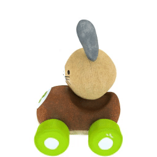
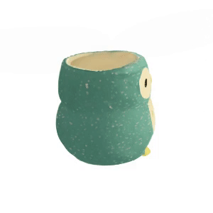
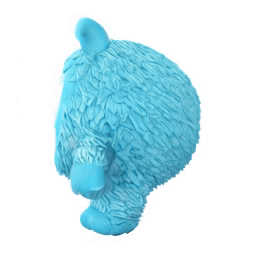

&nbsp;

<div align="center">

<h3>Baking Gaussian Splatting into Diffusion Denoiser for Fast <br> and Scalable Single-stage Image-to-3D Generation and Reconstruction</h3> 

[](https://arxiv.org/abs/2411.14384)
[](https://caiyuanhao1998.github.io/project/DiffusionGS/)
[](https://huggingface.co/datasets/CaiYuanhao/DiffusionGS)
[](https://x.com/janusch_patas/status/1859867424859856997?ref_src=twsrc%5Egoogle%7Ctwcamp%5Eserp%7Ctwgr%5Etweet)

<p align="center">
  
  
  
  
</p>
<p align="center">
  
  
  
  
</p>
<p align="center">
  
  
</p>
<p align="center">
  
  
</p>


&nbsp;

</div>


### Introduction
This is an implementation of our work "Baking Gaussian Splatting into Diffusion Denoiser for Fast and Scalable Single-stage Image-to-3D Generation and Reconstruction
". Our DiffusionGS is single-stage and does not rely on 2D multi-view diffusion model. DiffusionGS can be applied to single-view 3D object generation and scene reconstruction without using depth estimator in ~6 seconds. If you find our repo useful, please give it a star ⭐ and consider citing our paper. Thank you :)


### News
- **2024.11.22 :** Our [project page](https://caiyuanhao1998.github.io/project/DiffusionGS/) has been built up. Feel free to check the video and interactive generation results on the project page.
- **2024.11.21 :** We upload the prompt image and our generation results to our [hugging face dataset](https://huggingface.co/datasets/CaiYuanhao/DiffusionGS). Feel free to download and make a comparison with your method. 🤗
- **2024.11.20 :** Our paper is on [arxiv](https://arxiv.org/abs/2411.14384) now. 🚀

### Comparison with State-of-the-Art Methods

<details close>
<summary><b>Qualitative Comparison</b></summary>


</details>


<details close>
<summary><b>Quantitative Comparison</b></summary>


</details>


&nbsp;

## Citation
```sh
@article{cai2024baking,
  title={Baking Gaussian Splatting into Diffusion Denoiser for Fast and Scalable Single-stage Image-to-3D Generation and Reconstruction},
  author={Yuanhao Cai and He Zhang and Kai Zhang and Yixun Liang and Mengwei Ren and Fujun Luan and Qing Liu and Soo Ye Kim and Jianming Zhang and Zhifei Zhang and Yuqian Zhou and Yulun Zhang and Xiaokang Yang and Zhe Lin and Alan Yuille},
  journal={arXiv preprint arXiv:2411.14384},
  year={2024}
}
```
